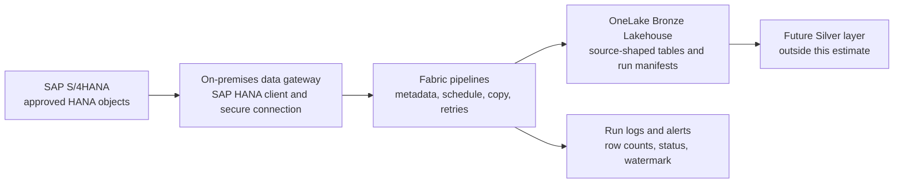

# SAP S/4HANA → Microsoft Fabric: Bronze ingestion proposal

**Planning estimate · 25 September 2026 · 15 source objects · EUR, excluding VAT**

## 1. Executive estimate

| Measure | Baseline |
|---|---:|
| Scope | 15 approved SAP S/4HANA extraction objects → 15 Bronze datasets |
| Delivery duration | 7 elapsed weeks, subject to access and SAP approvals |
| Delivery effort | 93 person-days |
| Professional services | €69,050 |
| Planning contingency, 15% | €10,357.50 |
| **Budget allowance** | **€79,407.50 (round to €79,500)** |

This is a **ROM / planning estimate**, not a fixed-price offer. Day rates are illustrative assumptions, not a quotation. Capacity, gateway hosting, OneLake storage, network charges, SAP licensing, and SAP team effort are outside the services total. A source profiling spike in week 1 must validate object type, extraction entitlement, volumes, delete handling, and refresh needs.

## 2. Decision and scope boundary

**Baseline:** schedule Fabric Data Factory copy activities against approved SAP HANA-accessible objects, through an on-premises data gateway, into a Fabric Bronze Lakehouse. Select a permitted source interface with the SAP owner: approved HANA view or table, SAP application-server table connector, or an exposed OData API. The costed design assumes the HANA connector and queryable approved objects; interface changes require re-estimation. Microsoft's Fabric SAP HANA connector supports pipeline copy as a source, and the SAP Table connector offers another snapshot route. [S1][S2][S3]

Bronze captures source-shaped data, with only technical conversions necessary for extraction, plus load metadata. No joins, business rules, KPI calculations, dimensional models, semantic models, downstream Silver/Gold, or SAP write-backs are included.

**Critical distinction:** a timestamp or key-based incremental read can miss deletes and updates that do not change the selected watermark. The baseline therefore supports *full snapshot* for small objects and *watermark-based append of extracted batches* only where SAP validates a reliable change field. It does **not** promise current-state CDC or complete deletion capture. If those are required, approve an SAP ODP/CDC or Datasphere replication design and estimate it separately. Microsoft's documented SAP CDC-to-OneLake route uses Azure Data Factory and a self-hosted integration runtime; SAP mirroring uses SAP Datasphere and ADLS Gen2, with separate SAP commercial considerations. [S4][S5]

## 3. Architecture

**Object contract.** Each object has an approved source name/query, primary or business key when known, expected row count/size, extraction mode, watermark field and timezone (if applicable), allowed schedule, data owner, sensitivity, and retention policy. Configure metadata, rather than cloning 15 independent orchestration designs.

**Landing pattern.** Write each extraction as an immutable batch under `Files/bronze/sap_s4/<object>/load_date=YYYY-MM-DD/run_id=<id>/` with source field names and types as faithfully as practical. Store a run manifest containing extraction window, UTC start/end, status, counts, bytes, schema version and source query reference. Publish/refresh one queryable Bronze Delta table per object after a successful batch, using a documented full-replace or append policy. Keep historical batches according to agreed retention. This dual file/table layout and any conversions are implementation design assumptions, to be validated for actual connector sink support and data types in the spike.

**Control flow.** A schedule selects enabled objects; a metadata-driven loop executes bounded parallel copies; success validates basic counts and records the manifest, then advances the watermark; failure records an error and leaves the watermark unchanged. Re-run the same extraction window with a deterministic `run_id` or replace its partition to prevent duplicate publication. For full snapshots, publish only a completed snapshot. Configure alerts for failures and SLA breaches.

**Security and operations.** SAP provides a read-only service identity scoped to approved extraction objects. Gateway host(s) and Fabric connections are controlled by platform administrators; encrypt transit, restrict workspace roles, classify sensitive fields, and agree log retention. Use separate dev/test/prod workspaces and deployment controls if already available; new platform-wide CI/CD infrastructure is excluded. Initial gateway sizing, HA, firewall and certificate requirements are owned jointly by infrastructure and SAP Basis.

## 4. Explicit planning assumptions

| ID | Assumption for baseline estimate | If false |
|---|---|---|
| A1 | Exactly 15 objects; one SAP system/client; object list and SAP ownership provided at kickoff. | Re-scope object count and source topology. |
| A2 | Approved HANA-accessible objects and direct read permission are provided; SAP validates that extraction complies with its support and licensing rules. | Use approved SAP Table/CDS/OData/ODP interface and re-estimate. |
| A3 | Existing paid Fabric capacity, tenant, workspaces, and OneLake are available; no new capacity is procured. | Add infrastructure cost and setup effort. |
| A4 | Gateway host and network path to SAP are supplied by client; SAP HANA client/driver and certificate setup can be completed in week 1. | Schedule slips; add infrastructure work. |
| A5 | Daily refresh, one initial historical load, no hard near-real-time SLA. | Rework orchestration and sizing. |
| A6 | Up to 10 GB compressed initial extraction per object (150 GB total); average daily changed extract ≤1 GB total; overall ≤30 GB/day full snapshot output where applicable. **Sizing placeholders, not measured SAP volumes.** | Benchmark and reprice capacity, duration, and possibly parallelism. |
| A7 | 5 small objects use daily full snapshots; 10 have SAP-validated watermark fields. No guaranteed delete capture for watermark objects. | Switch more objects to snapshot, or separately design CDC. |
| A8 | Source owner supplies field definitions, key candidates, and expected counts; only technical data profiling is included. | Add SAP functional analysis. |
| A9 | Standard scalar columns, manageable LOBs, no unusual nested payloads; schemas are stable during implementation. | Add conversion and schema drift effort. |
| A10 | SAP Basis/security decisions and test data are available within 3 business days; SAP-side development and licenses are client supplied. | Extend timeline. |
| A11 | Retention and classification approved before production; baseline assumes 90 days of immutable batch files and latest queryable table for each object. | Recompute storage and operations. |
| A12 | Two environments for development/test and production access exist; client provides access and releases. | Add environment setup and release effort. |

**Open design decisions requiring client confirmation:** the exact 15 object names and interfaces; historical date range; row counts, row widths and sensitive fields; permitted extraction windows and source query load; required freshness; deletes and corrections; gateway location; availability of SAP Datasphere/ODP; operational ownership of alerts and retention. The baseline price should be revised after these are answered.

## 5. Work breakdown and staffing

| Work package | Architect (d) | Tech lead (d) | Data engineer 1 (d) | Data engineer 2 (d) | Total (d) |
|---|---:|---:|---:|---:|---:|
| Discovery, SAP interface and volume profiling | 3 | 3 | 2 | 2 | 10 |
| Architecture, security and object contracts | 3 | 3 | 1 | 1 | 8 |
| Gateway, connections, environments and access | 1 | 4 | 3 | 2 | 10 |
| Metadata framework, orchestration, logs and retry | 0 | 7 | 7 | 5 | 19 |
| Implement and tune 15 Bronze objects | 0 | 4 | 11 | 13 | 28 |
| Reconciliation, failure/restart and load testing | 1 | 2 | 4 | 4 | 11 |
| Release, documentation and handover | 0 | 2 | 2 | 3 | 7 |
| **Total days** | **8** | **25** | **30** | **30** | **93** |

The architect and lead are **part-time across the seven weeks**; each engineer averages about 4.3 days/week. Four named roles do not mean four full-time resources for seven weeks. SAP Basis/security and business owner participation are dependencies, not included person-days.

| Role | Days | Assumed day rate | Extended cost |
|---|---:|---:|---:|
| Architect | 8 | €1,100 | €8,800 |
| Tech lead | 25 | €850 | €21,250 |
| Data engineer 1 | 30 | €650 | €19,500 |
| Data engineer 2 | 30 | €650 | €19,500 |
| **Services subtotal** | **93** | | **€69,050** |
| Contingency, 15% | | | €10,357.50 |
| **Planning allowance** | | | **€79,407.50** |

**Rate sensitivity:** every €100/day change in the architect, lead, or each engineer rate changes the services total by €800, €2,500, or €3,000, respectively (before contingency). Every extra average 2 engineer-days per object adds 30 engineer-days, or €19,500 at the assumed engineer rate (before contingency).

## 6. Calendar and acceptance

| Week | Outcome | Gate |
|---|---|---|
| 1 | Confirm objects, SAP approval, extraction mode, source profiling, gateway proof of connectivity | Sign off the extraction contract and re-baseline material variances |
| 2 | Complete security, metadata model, first two objects, initial load pattern | Representative small and large object copy succeeds |
| 3–4 | Develop shared orchestration and next eight objects | Automated rerun, manifests and row count controls work |
| 5 | Finish remaining five objects and initial loads | All 15 technical loads pass |
| 6 | Reconciliation, performance, failure and restart tests, operational alerting | SAP owner accepts discrepancies and extraction window |
| 7 | Production release, documentation and handover | Runbook, 15 object contracts, evidence and ownership accepted |

**Definition of done:** 15 approved source mappings and Bronze datasets; successful initial load and at least two scheduled cycles; source-to-target count comparison per load (with documented query/filter and any expected discrepancy); failed-run replay without silently advancing a watermark; technical schema, run manifest, monitoring, access review, and runbook delivered. No claim of delete completeness is made unless the chosen mechanism captures and validates deletes.

## 7. Platform cost model and sizing gate

**Do not add a fabricated monthly cloud price to the services quote.** An existing Fabric F16 capacity is a possible starting context, not evidence of free spare headroom. Verify its actual SKU, region, negotiated price, concurrency and current utilization. Fabric capacity cost may already be budgeted, while incremental workload consumption can still drive throttling or a resize. Microsoft lists F16 as 16 CUs and advises assessing real workload consumption in the Capacity Metrics app. [S6]

| Cost component | Reproducible estimate / decision |
|---|---|
| Fabric pipeline copy | `Σ(copy duration hours × intelligent throughput units × 1.5 CU-hours)`; add `orchestration activity runs × 0.0056 CU-hours`. Measure representative objects. [S7] |
| Capacity budget | `incremental CU-hours × contractual €/CU-hour equivalent`; also test peak concurrent CU use against existing workloads. Do not treat that expression as an extra invoice when running inside an already paid fixed capacity. |
| Bronze storage | `retained raw batches + current Delta tables + transaction logs/overhead`; calculate GB-months using measured compressed size, refresh strategy and retention, multiplied by actual regional OneLake storage price. |
| Gateway host | Client-supplied VM/OS/monitoring/backup or new infrastructure quote; validate CPU, RAM, disk and availability with a load test. |
| Networking/SAP | Confirm private connectivity/egress and any SAP extract/ODP/Datasphere entitlements with vendors. |

**Illustration only, not a quoted bill:** 15 copies/day × 20 minutes each × 2 throughput units × 1.5 CU-hours = **15 CU-hours/day** for copy, before orchestration; 450 CU-hours in a 30-day month. This is deliberately a formula example: actual copy duration and intelligent throughput must come from the pilot, not from object count. For a 90-day file-retention scenario, 30 GB/day of full snapshots implies around **2.7 TB of raw batch files**, before Delta copies, metadata and compression differences; at the illustrative 1 GB/day incremental-only volume, 90 days adds about **90 GB**. Actual mix matters.

## 8. Risks and change controls

| Risk | Trigger | Treatment |
|---|---|---|
| SAP extraction policy or S/4HANA semantics differ from HANA SQL visibility | Source owner declines direct reads or requires released APIs/CDS | Select compliant interface in week 1; re-estimate connector and SAP work. |
| Watermark omits deletes or backdated corrections | Reconciliation fails after changes | Use periodic full reconciliation or approved SAP CDC; do not label baseline as complete replication. |
| Large full loads stress transactional SAP | Queries exceed approved window | Benchmark, filter/partition where supported, limit concurrency and coordinate with Basis. |
| Gateway/network approvals delay access | No successful connection in week 1 | Escalate dependency and revise elapsed time, retaining effort estimate if unchanged. |
| Fabric shared capacity has insufficient headroom | Metrics show throttling | Reschedule copies, tune parallelism or separately budget capacity upgrade. |
| Sensitive fields and retention are unresolved | Security approval pending | Block production publication until classified and access restricted. |

## 9. Reference documentation

- [S1] [Fabric SAP HANA connector overview](https://learn.microsoft.com/en-us/fabric/data-factory/connector-sap-hana-overview), supported pipeline copy and copy job modes.
- [S2] [Configure SAP HANA in a copy activity](https://learn.microsoft.com/en-us/fabric/data-factory/connector-sap-hana-copy-activity), query/partition options.
- [S3] [Extract SAP data to Microsoft Fabric](https://learn.microsoft.com/en-us/azure/sap/workloads/extract-sap-data), extraction options and SAP Table snapshots.
- [S4] [SAP CDC to OneLake with Azure Data Factory](https://learn.microsoft.com/en-us/azure/data-factory/change-data-capture-from-sap-to-onelake-with-azure-data-factory), alternative CDC architecture.
- [S5] [Fabric mirroring from SAP](https://learn.microsoft.com/en-us/fabric/mirroring/sap), Datasphere and commercial considerations.
- [S6] [Plan Fabric capacity size](https://learn.microsoft.com/en-us/fabric/enterprise/plan-capacity), CUs and capacity metrics.
- [S7] [Fabric pipeline pricing](https://learn.microsoft.com/en-us/fabric/data-factory/pricing-pipelines), consumption formula.

*All rates, workloads, retention and object-mode mix above are proposal assumptions. Validate with the SAP team and a representative pilot before committing to a fixed price or SLA.*
