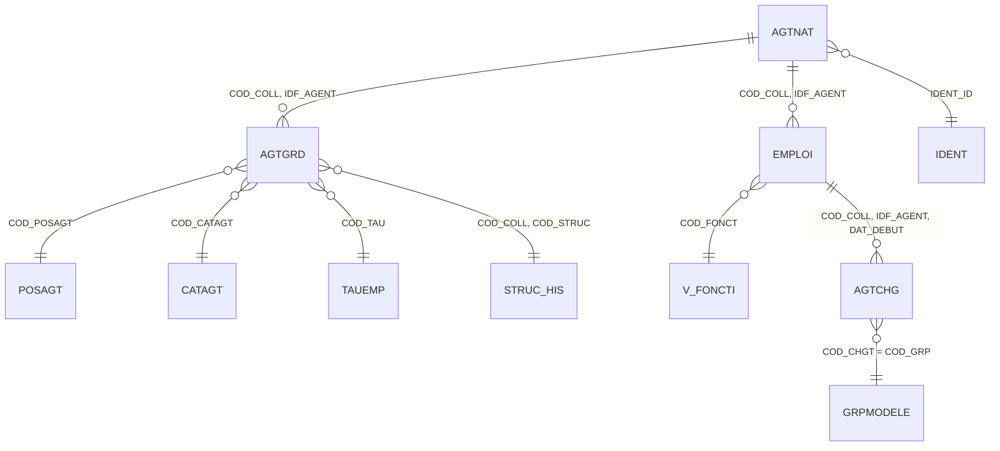

# HR KPI reverse engineering: Silver and Gold design

## 1. Scope and confidence

This design was inferred from the 21 Oracle SQL screenshots in `IMG20260922175602.pdf`. The queries use the `RH` schema and calculate workforce KPIs for organism `PACA` at either a point-in-time (`DATE_RECHERCHE`) or over a reporting interval (`DATE_DEB`/`DATE_FIN`).

The screenshots expose only the columns used by the KPI queries, not the complete Oracle catalog. Therefore:

- table and column names shown below are **observed** unless marked *inferred*;
- primary keys and datatypes are **candidate definitions** to validate against Oracle constraints and `ALL_TAB_COLUMNS`;
- effective dates are not automatically safe CDC watermarks: an old row may be updated in place;
- the SQL assumes the established target architecture: Bronze and Silver in Fabric Lakehouse, Gold in Fabric Warehouse.

## 2. Reconstructed business areas

The queries cover these subjects:

1. Agent identity and entry/departure dates.
2. Effective-dated career state: administrative position, category, grade, structure and work rate.
3. Primary employment (`NUM_EMPLOI = 1`): function and remuneration attributes.
4. Change events: grade and echelon nominations.
5. Organisational hierarchy and ARS/ARL/CREPS regrouping.
6. Demographics: birth date, age and sex.

Two distinct grains must be retained:

- **state/snapshot grain:** one agent at one reporting date;
- **event grain:** one agent event on its effective date.

Combining both into one wide physical fact would duplicate agents and make KPI counts unreliable.

## 3. Source relationship model



Relationships are logical inferences from joins; they are not proof of declared Oracle foreign keys.

## 4. Source data dictionary

### 4.1 `RH.AGTNAT` - agent master

| Column | Suggested type | Meaning | Role |
|---|---|---|---|
| `COD_COLL` | `STRING` | Organism/collectivity code | Candidate PK/FK |
| `IDF_AGENT` | `STRING` | Agent identifier / matricule | Candidate PK |
| `IDENT_ID` | `STRING` | Link to identity/person | FK to `IDENT` |
| `DAT_ENTCOLL` | `DATE` | Date agent entered the collectivity | Event/increment candidate |
| `DAT_DEPART` | `DATE` | Agent file departure date | Event/increment candidate |
| `COD_GESTION` | `STRING` | Management code | Attribute observed in later KPI queries |

Candidate uniqueness: `(COD_COLL, IDF_AGENT)`. Validate whether a person can have several agent records or reused matricules.

### 4.2 `RH.AGTGRD` - effective-dated career assignment

| Column | Suggested type | Meaning | Role |
|---|---|---|---|
| `COD_COLL` | `STRING` | Organism | Candidate key/FK |
| `IDF_AGENT` | `STRING` | Agent | Candidate key/FK |
| `DAT_DEBUT` | `DATE` | Career-state validity start | Candidate key/effective start |
| `DAT_FIN` | `DATE` | Career-state validity end, apparently exclusive | Effective end |
| `COD_POSAGT` | `STRING` | Administrative position code | FK to `POSAGT` |
| `COD_TAU` | `STRING` | Employment-rate code | FK to `TAUEMP` |
| `COD_CATAGT` | `STRING` | Agent category code | FK to `CATAGT` |
| `COD_GRADE` | `STRING` | Grade code | FK to `GRADE` |
| `COD_STRUC` | `STRING` | Hierarchical structure code | FK to `STRUC_HIS` |

Candidate uniqueness: `(COD_COLL, IDF_AGENT, DAT_DEBUT)`. If simultaneous assignments exist, extend with `COD_POSAGT`, `COD_GRADE` or a source technical identifier.

### 4.3 `RH.EMPLOI` - effective-dated employment/assignment

| Column | Suggested type | Meaning | Role |
|---|---|---|---|
| `COD_COLL` | `STRING` | Organism | Candidate key/FK |
| `IDF_AGENT` | `STRING` | Agent | Candidate key/FK |
| `NUM_EMPLOI` | `INT` | Employment sequence; KPI queries select `1` or `99` | Candidate key |
| `DAT_DEBUT` | `DATE` | Employment validity start | Candidate key/effective start |
| `DAT_FIN` | `DATE` | Employment validity end, apparently exclusive | Effective end |
| `COD_CHGT` | `STRING` | Change/event group code | FK to `GRPMODELE` |
| `COD_FONCT` | `STRING` | Function code | FK to `V_FONCTI` |
| `COD_CATAGT` | `STRING` | Category code | Attribute/FK |
| `COD_POSAGT` | `STRING` | Administrative position code | Attribute/FK |
| `COD_TYPREMUN` | `STRING` | Remuneration type | Attribute |
| `COD_CLASREMUN` | `STRING` | Remuneration class | Attribute |
| `COD_EQREMUN` | `STRING` | Remuneration equivalence | Attribute |
| `IND_PAIE` | `STRING/BOOLEAN` | Right-to-pay indicator | Attribute |

Candidate uniqueness: `(COD_COLL, IDF_AGENT, NUM_EMPLOI, DAT_DEBUT)`. Validate whether `COD_CHGT` participates in the source key.

### 4.4 `RH.AGTCHG` - agent change events

| Column | Suggested type | Meaning | Role |
|---|---|---|---|
| `COD_COLL` | `STRING` | Organism | Candidate key/FK |
| `IDF_AGENT` | `STRING` | Agent | Candidate key/FK |
| `NUM_EMPLOI` | `INT` | Employment sequence (`99` in nomination queries) | Candidate key |
| `DAT_DEBUT` | `DATE` | Event/effective date | Candidate key/increment field |
| `COD_CHGT` | `STRING` | Change type/group (`PIT`, `GRA`, `ECH`, etc.) | Candidate key/FK |

Candidate uniqueness: `(COD_COLL, IDF_AGENT, NUM_EMPLOI, DAT_DEBUT, COD_CHGT)`.

### 4.5 Reference and identity tables

| Source table | Observed columns | Candidate unique key | Meaning |
|---|---|---|---|
| `RH.POSAGT` | `COD_POSAGT`, `TYP_DEP`, `LIB_POSAGT` | `COD_POSAGT` | Administrative position; `P=Provisoire`, `D=Définitif`, `X=Activité` observed |
| `RH.TAUEMP` | `COD_TAU`, `TAU_REEL`, `VAL_NUMER`, `VAL_DENOMI`, `TAU_AFF`, `TAU_LIB` | `COD_TAU` | Work-rate reference |
| `OG.IDENT` | `IDENT_ID`, `DAT_NAISSANCE`, `COD_SEXE` | `IDENT_ID` | Person/demographic identity |
| `RH.CATAGT` | `COD_CATAGT`, `LIB_CATAGT` | `COD_CATAGT` | Agent category |
| `RH.GRADE` | `COD_GRADE`, `LIB_GRADE`, `COD_CADRE`, `DAT_DEBUT`, `DAT_FIN` | `(COD_GRADE, DAT_DEBUT)` | Effective-dated grade reference |
| `RH.V_CADEMP` | `COD_GRADE`, `COD_CADREMPL`, `LIB_CADEMPL`, `DAT_DEBUT`, `DAT_FIN` | `(COD_GRADE, DAT_DEBUT)` | Employment framework for a grade |
| `RH.V_FONCTI` | `COD_FONCT`, `LIB_FONCTION` | `COD_FONCT` | Function reference/view |
| `RH.GRPMODELE` | `COD_GRP`, `LIB_GRP` | `COD_GRP` | Change/event labels |
| `RH.STRUC_HIS` | `COD_COLL`, `COD_STRUC`, `LIB_STRUC`, `COD_STRUC_FONC`, `COD_STRUC_GEO`, `STRUC_PERE_HIER`, `DAT_DEBUT`, `DAT_FIN` | `(COD_COLL, COD_STRUC, DAT_DEBUT)` | Effective-dated organisation hierarchy |
| `RH.POSSTA` *(name inferred from screenshot)* | `COD_POSSTA`, `LIB_POSSTA` | `COD_POSSTA` | Statutory position reference |

## 5. Source date semantics found in the KPI SQL

The point-in-time queries consistently use half-open validity:

```sql
DAT_DEBUT <= :SNAPSHOT_DATE
AND DAT_FIN > :SNAPSHOT_DATE
```

This means `DAT_FIN` must be treated as **exclusive**. Do not replace `>` with `>=`.

Interval queries show two patterns:

```sql
-- Event occurrence
EVENT_DATE BETWEEN :DATE_DEB AND :DATE_FIN

-- Effective period overlap
DAT_DEBUT < :DATE_FIN
AND DAT_FIN > :DATE_DEB
```

For a robust warehouse contract, use half-open reporting intervals `[DATE_FROM, DATE_TO_EXCLUSIVE)` and translate inclusive input end dates once at the orchestration boundary.

The value `2099-12-31` is used as an open-ended sentinel. Silver should retain the source value and additionally expose `IS_CURRENT`.

## 6. Incremental extraction strategy

### 6.1 Recommended fields

| Table | Preferred incremental field | Fallback | Risk/handling |
|---|---|---|---|
| `AGTNAT` | Source audit timestamp such as `DAT_MAJ` if present | `DAT_ENTCOLL`, `DAT_DEPART` + hash comparison | Departure may be populated long after entry |
| `AGTGRD` | Source audit timestamp | `DAT_DEBUT` with rolling overlap + hash | `DAT_FIN` may be corrected retroactively |
| `EMPLOI` | Source audit timestamp | `DAT_DEBUT` with rolling overlap + hash | Historical employment may be revised |
| `AGTCHG` | Source audit timestamp | `DAT_DEBUT` | Event date is usually suitable for append, but corrections still require overlap |
| `STRUC_HIS`, `GRADE`, `V_CADEMP` | Source audit timestamp | Full reload or `DAT_DEBUT` + hash | Small reference histories; full snapshot is safest |
| Static references | Source audit timestamp | Full reload + hash | Low volume |

**Important:** `DAT_DEBUT` is a business-effective date, not necessarily a modification timestamp. If Oracle exposes `DAT_MAJ`/`USER_MAJ`, use `(DAT_MAJ, source_key)` as the deterministic watermark. Otherwise ingest a full snapshot or a generous rolling window and MERGE by business key plus row hash.

### 6.2 Metadata recommendation

Store for each source entity:

- `SOURCE_KEY_COLUMNS`
- `INCREMENTAL_COLUMN`
- `WATERMARK_FROM`
- `WATERMARK_TO_EXCLUSIVE`
- `OVERLAP_DAYS`
- `LOAD_STRATEGY` (`FULL_HASH`, `WATERMARK_MERGE`, `APPEND_EVENT`)
- `EXPECTED_UNIQUENESS_RULE`

## 7. Silver model

Use source-aligned, cleaned Delta tables. Preserve source names for traceability and add technical columns.

| Silver table | Grain / unique key | Main purpose |
|---|---|---|
| `silver.hr_agent` | `(organism_code, agent_id)` | Agent master |
| `silver.hr_agent_career_period` | `(organism_code, agent_id, valid_from)` | Effective career state |
| `silver.hr_employment_period` | `(organism_code, agent_id, employment_no, valid_from)` | Employment/function/remuneration state |
| `silver.hr_agent_change_event` | `(organism_code, agent_id, employment_no, event_date, change_code)` | Nominations and other events |
| `silver.ref_admin_position` | `admin_position_code` | Position lookup |
| `silver.ref_work_rate` | `work_rate_code` | Work-rate lookup |
| `silver.hr_person_identity` | `identity_id` | Birth date and sex; restricted access |
| `silver.ref_agent_category` | `agent_category_code` | Category lookup |
| `silver.ref_grade_period` | `(grade_code, valid_from)` | Effective grade label/cadre |
| `silver.ref_employment_framework_period` | `(grade_code, valid_from)` | Cadre d'emploi |
| `silver.ref_function` | `function_code` | Function lookup |
| `silver.ref_change_group` | `change_group_code` | Event lookup |
| `silver.ref_structure_period` | `(organism_code, structure_code, valid_from)` | Effective hierarchy |

Every Silver table should also carry:

```text
_source_system, _source_table, _ingested_at_utc, _batch_id,
_row_hash, _is_deleted, _source_extract_from, _source_extract_to
```

### 7.1 Bronze-to-Silver MERGE template (Spark SQL)

Fabric Lakehouse writes should run through Spark SQL/Delta, not through the read-only SQL analytics endpoint.

```sql
MERGE INTO silver.hr_agent_career_period AS tgt
USING (
    SELECT
        TRIM(COD_COLL)                              AS organism_code,
        TRIM(IDF_AGENT)                             AS agent_id,
        CAST(DAT_DEBUT AS DATE)                     AS valid_from,
        CAST(DAT_FIN AS DATE)                       AS valid_to_exclusive,
        TRIM(COD_POSAGT)                            AS admin_position_code,
        TRIM(COD_TAU)                               AS work_rate_code,
        TRIM(COD_CATAGT)                            AS agent_category_code,
        TRIM(COD_GRADE)                             AS grade_code,
        TRIM(COD_STRUC)                             AS structure_code,
        CAST(DAT_FIN AS DATE) = DATE '2099-12-31'   AS is_current,
        current_timestamp()                         AS _ingested_at_utc,
        '${batch_id}'                               AS _batch_id,
        sha2(concat_ws('||',
            coalesce(TRIM(COD_POSAGT), ''),
            coalesce(TRIM(COD_TAU), ''),
            coalesce(TRIM(COD_CATAGT), ''),
            coalesce(TRIM(COD_GRADE), ''),
            coalesce(TRIM(COD_STRUC), ''),
            coalesce(CAST(DAT_FIN AS STRING), '')
        ), 256)                                     AS _row_hash
    FROM bronze.rh_agtgrd
) AS src
ON  tgt.organism_code = src.organism_code
AND tgt.agent_id = src.agent_id
AND tgt.valid_from = src.valid_from
WHEN MATCHED AND tgt._row_hash <> src._row_hash THEN UPDATE SET *
WHEN NOT MATCHED THEN INSERT *;
```

Apply the same pattern to other source-aligned tables using the candidate keys in the table above. Where key collisions occur, stop the load and profile the missing discriminator rather than deduplicating arbitrarily.

### 7.2 Silver quality rules

```sql
-- Candidate-key duplicates
SELECT organism_code, agent_id, valid_from, COUNT(*) AS row_count
FROM silver.hr_agent_career_period
GROUP BY organism_code, agent_id, valid_from
HAVING COUNT(*) > 1;

-- Invalid periods
SELECT *
FROM silver.hr_agent_career_period
WHERE valid_from >= valid_to_exclusive;

-- Overlapping periods for an agent
WITH x AS (
  SELECT *,
         LAG(valid_to_exclusive) OVER (
           PARTITION BY organism_code, agent_id ORDER BY valid_from
         ) AS previous_valid_to
  FROM silver.hr_agent_career_period
)
SELECT * FROM x WHERE valid_from < previous_valid_to;
```

## 8. Gold dimensional model

### 8.1 Dimensions

| Gold object | Grain / key | SCD policy |
|---|---|---|
| `gold.dim_agent` | one agent; surrogate `agent_key` | Type 1 for identifiers; restrict PII |
| `gold.dim_admin_position` | one position code | Type 1 |
| `gold.dim_agent_category` | one category code | Type 1 |
| `gold.dim_grade` | one grade version | Type 2/effective-dated |
| `gold.dim_function` | one function code | Type 1 |
| `gold.dim_structure` | one structure version | Type 2 with parent key |
| `gold.dim_work_rate` | one rate code | Type 1 |
| `gold.dim_change_event_type` | one change code | Type 1 |
| `gold.dim_date` | one calendar date | Static |

Avoid storing current age in `dim_agent`; age changes with the snapshot date. Store birth date under restricted access and calculate `age_years` in the snapshot fact.

### 8.2 Facts

#### `gold.fact_agent_snapshot`

Grain: **one organism + agent + snapshot date**. Candidate unique key:

```text
(snapshot_date_key, organism_code, agent_key)
```

Measures/attributes: age, work rate, paid flag, primary-employment attributes, current position/category/grade/function/structure, sex, and grouping.

#### `gold.fact_agent_period`

Grain: one conformed effective career segment. Candidate unique key:

```text
(organism_code, agent_key, period_start_date_key, career_version_sequence)
```

Useful for duration/FTE KPIs without generating one row per day.

#### `gold.fact_agent_event`

Grain: one dated agent event. Candidate unique key:

```text
(event_date_key, organism_code, agent_key, employment_no, event_type_key)
```

Events include collectivity entry, departure, grade nomination, echelon nomination and other `AGTCHG` codes.

## 9. Silver-to-Gold load SQL

### 9.1 Snapshot staging query (Fabric Warehouse T-SQL)

This query replaces repeated point-in-time joins in individual KPIs. It uses half-open validity and `ROW_NUMBER` guards to make the intended primary record explicit.

```sql
DECLARE @SNAPSHOT_DATE date = ?;

WITH career AS (
    SELECT c.*,
           ROW_NUMBER() OVER (
             PARTITION BY c.organism_code, c.agent_id
             ORDER BY c.valid_from DESC
           ) AS rn
    FROM silver.hr_agent_career_period c
    WHERE c.valid_from <= @SNAPSHOT_DATE
      AND c.valid_to_exclusive > @SNAPSHOT_DATE
),
employment AS (
    SELECT e.*,
           ROW_NUMBER() OVER (
             PARTITION BY e.organism_code, e.agent_id
             ORDER BY e.valid_from DESC
           ) AS rn
    FROM silver.hr_employment_period e
    WHERE e.employment_no = 1
      AND e.valid_from <= @SNAPSHOT_DATE
      AND e.valid_to_exclusive > @SNAPSHOT_DATE
),
structure AS (
    SELECT s.*,
           ROW_NUMBER() OVER (
             PARTITION BY s.organism_code, s.structure_code
             ORDER BY s.valid_from DESC
           ) AS rn
    FROM silver.ref_structure_period s
    WHERE s.valid_from <= @SNAPSHOT_DATE
      AND s.valid_to_exclusive > @SNAPSHOT_DATE
)
SELECT
    CONVERT(int, FORMAT(@SNAPSHOT_DATE, 'yyyyMMdd')) AS snapshot_date_key,
    a.organism_code,
    da.agent_key,
    dap.admin_position_key,
    dac.agent_category_key,
    dg.grade_key,
    df.function_key,
    ds.structure_key,
    dwr.work_rate_key,
    DATEDIFF(year, pi.birth_date, @SNAPSHOT_DATE)
      - CASE WHEN DATEADD(year, DATEDIFF(year, pi.birth_date, @SNAPSHOT_DATE), pi.birth_date) > @SNAPSHOT_DATE THEN 1 ELSE 0 END AS age_years,
    pi.sex_code,
    wr.work_rate_display AS work_rate,
    CASE WHEN e.pay_entitlement_indicator IN ('1','Y','O') THEN 1 ELSE 0 END AS is_paid,
    e.remuneration_type_code,
    e.remuneration_class_code,
    e.remuneration_equivalence_code,
    CASE
      WHEN c.structure_code = 'CREPS' THEN 'CREPS'
      WHEN LEFT(c.structure_code, 1) BETWEEN '0' AND '9' THEN 'ARS'
      ELSE 'ARL'
    END AS structure_group_code,
    SYSUTCDATETIME() AS loaded_at_utc
FROM silver.hr_agent a
JOIN career c
  ON c.organism_code = a.organism_code AND c.agent_id = a.agent_id AND c.rn = 1
LEFT JOIN employment e
  ON e.organism_code = a.organism_code AND e.agent_id = a.agent_id AND e.rn = 1
LEFT JOIN silver.hr_person_identity pi ON pi.identity_id = a.identity_id
LEFT JOIN silver.ref_work_rate wr ON wr.work_rate_code = c.work_rate_code
LEFT JOIN structure s
  ON s.organism_code = c.organism_code AND s.structure_code = c.structure_code AND s.rn = 1
LEFT JOIN gold.dim_agent da
  ON da.organism_code = a.organism_code AND da.agent_id = a.agent_id
LEFT JOIN gold.dim_admin_position dap ON dap.admin_position_code = c.admin_position_code
LEFT JOIN gold.dim_agent_category dac ON dac.agent_category_code = c.agent_category_code
LEFT JOIN gold.dim_grade dg
  ON dg.grade_code = c.grade_code
 AND @SNAPSHOT_DATE >= dg.valid_from AND @SNAPSHOT_DATE < dg.valid_to_exclusive
LEFT JOIN gold.dim_function df ON df.function_code = e.function_code
LEFT JOIN gold.dim_structure ds
  ON ds.organism_code = s.organism_code AND ds.structure_code = s.structure_code
 AND @SNAPSHOT_DATE >= ds.valid_from AND @SNAPSHOT_DATE < ds.valid_to_exclusive
LEFT JOIN gold.dim_work_rate dwr ON dwr.work_rate_code = c.work_rate_code
WHERE a.organism_code = 'PACA'
  AND c.admin_position_type IN ('P','X');
```

Persist the result with a delete-and-insert by `snapshot_date_key`, which is deterministic and safe for recomputation:

```sql
BEGIN TRANSACTION;
DELETE FROM gold.fact_agent_snapshot WHERE snapshot_date_key = @SNAPSHOT_DATE_KEY;
INSERT INTO gold.fact_agent_snapshot (/* explicit target columns */)
SELECT /* explicit staging columns */ FROM gold.stg_agent_snapshot;
COMMIT;
```

### 9.2 Event fact insert

```sql
INSERT INTO gold.fact_agent_event (
    event_date_key, organism_code, agent_key, employment_no,
    event_type_key, grade_code, echelon_code, loaded_at_utc
)
SELECT
    CONVERT(int, FORMAT(e.event_date, 'yyyyMMdd')),
    e.organism_code,
    a.agent_key,
    e.employment_no,
    t.event_type_key,
    CASE WHEN e.change_code IN ('PIT','GRA') THEN c.grade_code END,
    CASE WHEN e.change_code IN ('ECO','MIN','MAX','MOY','UNI','UN2') THEN c.echelon_code END,
    SYSUTCDATETIME()
FROM silver.hr_agent_change_event e
JOIN gold.dim_agent a
  ON a.organism_code = e.organism_code AND a.agent_id = e.agent_id
JOIN gold.dim_change_event_type t ON t.change_code = e.change_code
LEFT JOIN silver.hr_agent_career_period c
  ON c.organism_code = e.organism_code
 AND c.agent_id = e.agent_id
 AND c.valid_from = e.event_date
WHERE e.event_date >= @FROM_DATE
  AND e.event_date < @TO_DATE_EXCLUSIVE
  AND NOT EXISTS (
      SELECT 1 FROM gold.fact_agent_event f
      WHERE f.event_date_key = CONVERT(int, FORMAT(e.event_date, 'yyyyMMdd'))
        AND f.organism_code = e.organism_code
        AND f.agent_key = a.agent_key
        AND f.employment_no = e.employment_no
        AND f.event_type_key = t.event_type_key
  );
```

`ECHELON_CODE` appears in a nomination KPI but is not clearly attributable in the screenshots; validate whether it belongs to `AGTGRD` and confirm its exact source spelling before implementing this column.

## 10. KPI-to-Gold mapping

| KPI family observed | Gold source | Filter/measure |
|---|---|---|
| Position departure type | `fact_agent_snapshot` + `dim_admin_position` | Count distinct agents by `P/D/X` label |
| Work rate / administrative rate | `fact_agent_snapshot` + `dim_work_rate` | Agents/FTE by rate fields |
| Entry into collectivity | `fact_agent_event` | Event type `ENTRY_COLLECTIVITY` in interval |
| Career departures | `fact_agent_period` or event fact | Departure positions, open-ended condition where required |
| Age | `fact_agent_snapshot` | `age_years` at snapshot date |
| Grade nomination | `fact_agent_event` | `PIT`/grade-change logic; retain previous-grade comparison |
| Echelon nomination | `fact_agent_event` | Change codes `ECO`, `MIN`, `MAX`, `MOY`, `UNI`, `UN2` |
| Structure/regroupement | `fact_agent_snapshot` + `dim_structure` | `CREPS`; first digit `0-9` => `ARS`; otherwise `ARL` |
| Category/function/cadre | Snapshot dimensions | Distinct agents grouped by dimension |
| Remuneration/paid status | `fact_agent_snapshot` | remuneration type/class/equivalence and paid flag |
| Sex | `fact_agent_snapshot` | `COD_SEXE`, decoded only in presentation layer |

## 11. Critical corrections relative to the legacy KPI SQL

1. Replace Oracle comma joins with explicit `JOIN` syntax.
2. Compare dates as dates; avoid `TO_CHAR(date,'YYYYMMDD')` predicates because they hinder index use and can hide type errors.
3. Standardise all point-in-time validity as `valid_from <= date AND valid_to_exclusive > date`.
4. Use exact age calculation. The legacy `ROUND((date - birth_date)/365)` can be off by one and ignores leap years.
5. Treat quoted aliases as presentation metadata, not physical warehouse column names.
6. Replace repeated scalar subqueries for grade/cadre/structure labels with effective-dated joins.
7. Never infer uniqueness by applying `DISTINCT`; assert the grain and fail on duplicates.
8. Keep `IDENT`/birth date in a restricted security domain; expose age bands where detailed birth dates are unnecessary.

## 12. Validation required before production

Run these checks against Oracle metadata and data:

```sql
-- Actual datatypes, nullability and order
SELECT OWNER, TABLE_NAME, COLUMN_NAME, DATA_TYPE, DATA_LENGTH,
       DATA_PRECISION, DATA_SCALE, NULLABLE, COLUMN_ID
FROM ALL_TAB_COLUMNS
WHERE OWNER IN ('RH','OG')
  AND TABLE_NAME IN (
    'AGTNAT','AGTGRD','EMPLOI','AGTCHG','POSAGT','TAUEMP','IDENT',
    'CATAGT','GRADE','V_CADEMP','V_FONCTI','GRPMODELE','STRUC_HIS','POSSTA'
  )
ORDER BY OWNER, TABLE_NAME, COLUMN_ID;

-- Declared PK/UK/FK constraints
SELECT c.OWNER, c.TABLE_NAME, c.CONSTRAINT_NAME, c.CONSTRAINT_TYPE,
       cc.COLUMN_NAME, cc.POSITION
FROM ALL_CONSTRAINTS c
JOIN ALL_CONS_COLUMNS cc
  ON cc.OWNER = c.OWNER AND cc.CONSTRAINT_NAME = c.CONSTRAINT_NAME
WHERE c.OWNER IN ('RH','OG')
  AND c.CONSTRAINT_TYPE IN ('P','U','R')
ORDER BY c.OWNER, c.TABLE_NAME, c.CONSTRAINT_NAME, cc.POSITION;
```

Also confirm:

- whether `DAT_FIN` is always non-null or sometimes uses `2099-12-31`;
- exact ownership and spelling of `COD_ECHELON`;
- whether `NUM_EMPLOI=99` is exclusively an event-carrier record;
- whether `COD_POSSTA` belongs to `EMPLOI`, `AGTGRD`, or another assignment table;
- whether `V_FONCTI` and `V_CADEMP` are views and what effective-date rules they already apply;
- whether source audit columns (`DAT_MAJ`, `USER_MAJ`, SCN) exist;
- whether agent career/employment periods can overlap legitimately.

## 13. Core Gold DDL (Fabric Warehouse)

Physical datatypes remain provisional until `ALL_TAB_COLUMNS` is supplied. The following is an implementable baseline; adjust code lengths to the source metadata.

```sql
CREATE TABLE gold.dim_agent (
    agent_key          bigint        NOT NULL,
    organism_code      varchar(30)   NOT NULL,
    agent_id           varchar(80)   NOT NULL,
    identity_id        varchar(80)   NULL,
    entry_date         date          NULL,
    departure_date     date          NULL,
    management_code    varchar(50)   NULL,
    loaded_at_utc      datetime2(6)  NOT NULL
);

CREATE TABLE gold.dim_structure (
    structure_key              bigint        NOT NULL,
    organism_code              varchar(30)   NOT NULL,
    structure_code             varchar(80)   NOT NULL,
    structure_label            varchar(500)  NULL,
    functional_structure_code  varchar(80)   NULL,
    geographical_structure_code varchar(80)  NULL,
    parent_structure_code      varchar(80)   NULL,
    structure_group_code       varchar(20)   NULL,
    valid_from                 date          NOT NULL,
    valid_to_exclusive         date          NOT NULL,
    is_current                 bit           NOT NULL,
    loaded_at_utc              datetime2(6)  NOT NULL
);

CREATE TABLE gold.fact_agent_snapshot (
    snapshot_date_key            int           NOT NULL,
    organism_code                varchar(30)   NOT NULL,
    agent_key                     bigint        NOT NULL,
    admin_position_key            bigint        NULL,
    agent_category_key            bigint        NULL,
    grade_key                     bigint        NULL,
    function_key                  bigint        NULL,
    structure_key                 bigint        NULL,
    work_rate_key                 bigint        NULL,
    age_years                     smallint      NULL,
    sex_code                      varchar(10)   NULL,
    work_rate                     decimal(18,6) NULL,
    is_paid                       bit           NULL,
    remuneration_type_code       varchar(50)   NULL,
    remuneration_class_code      varchar(50)   NULL,
    remuneration_equivalence_code varchar(50)  NULL,
    structure_group_code         varchar(20)   NULL,
    loaded_at_utc                datetime2(6)  NOT NULL
);

CREATE TABLE gold.fact_agent_event (
    event_date_key   int          NOT NULL,
    organism_code   varchar(30)  NOT NULL,
    agent_key        bigint       NOT NULL,
    employment_no   int          NOT NULL,
    event_type_key  bigint       NOT NULL,
    grade_code      varchar(50)  NULL,
    echelon_code    varchar(50)  NULL,
    loaded_at_utc   datetime2(6) NOT NULL
);
```

Fabric Warehouse informational constraints may be added after validation, but data-quality tests must still enforce uniqueness because such constraints are not a substitute for runtime validation.

## 14. Final recommendation

Use Silver as a faithful, effective-dated representation of the Oracle HR entities and Gold as a conformed workforce mart with separate snapshot, period and event facts. Generate the KPI outputs from Gold views rather than loading one physical table per KPI. This retains auditability, makes historical recomputation possible, and prevents 21 nearly identical Oracle joins from becoming 21 independent transformation pipelines.
